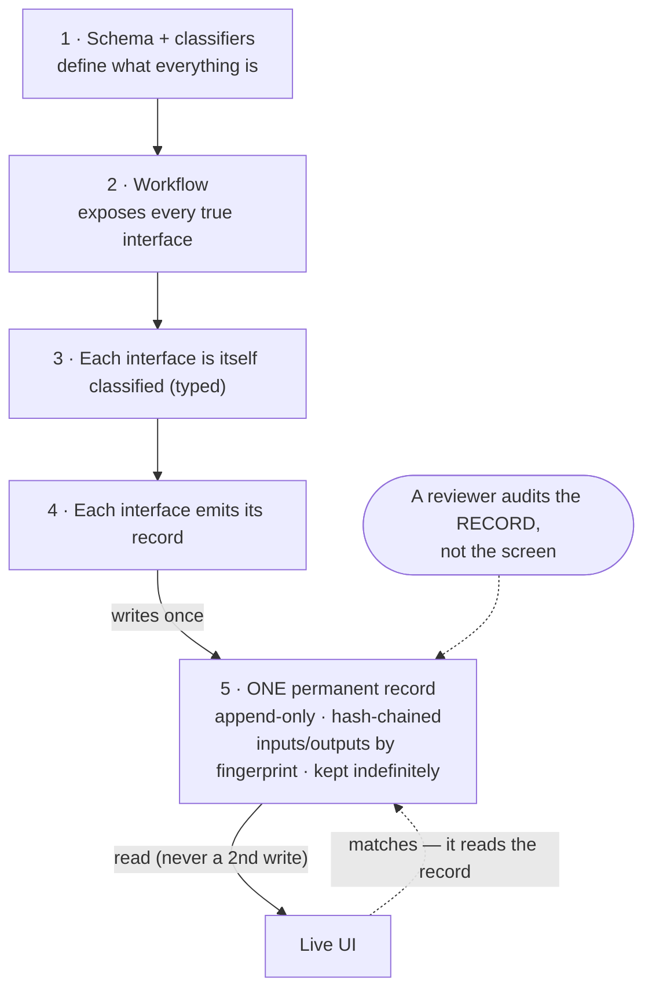

This is the rule. Each layer governs the layers below it. Everything in the system, and every page
of this documentation, is built to this and checked against it. If something doesn't fit here, it's
wrong — not the rule.

## The layers (top governs everything below)

1. **Schema + classifiers.** Typed definitions (Pydantic) of what every entity *is* — model
   families, variable roles, parameter roles. Everything below must obey them. A value that isn't
   validated against the schema doesn't count.
2. **The workflow.** Runs on the schema and **exposes every true interface** — every real point
   where data moves or changes form. Nothing hidden: data may only move *through* a declared,
   typed interface.
3. **Each interface is itself classified.** Every interface has its own typed definition. An
   interface is a known, inspectable thing — not ad-hoc.
4. **Each interface emits its record.** Every interface produces one entry in the audit trail —
   the account of what happened there, for that run.
5. **One record, shown live and kept forever.** See the rule below — this is the part that makes a
   run *provable* instead of just *displayed*.

## The proof rule (layer 5, stated exactly)

A result on a screen proves nothing — anything plausible can be drawn. Proof is a record a skeptic
can check without trusting our UI. So:

- **Write the value once,** to a single permanent, append-only record. The **UI reads from that
  record** — it never writes a second copy beside it. The live view and the record therefore
  *cannot disagree*; the UI is a window onto the record, not a duplicate of it.
- **Chain each entry to the one before it** (a hash of the previous entry). Any edit, deletion, or
  insertion breaks the chain and is detectable. That is what makes the record tamper-evident, not
  merely saved.
- **Store the actual inputs and outputs by their fingerprint** (the PDF, the page images, the
  output). A reviewer re-fingerprints and confirms it's the exact same file — nothing swapped.
- **Keep it indefinitely.** The record outlives the run, the cohort, and the UI.

Proof of a run = the permanent record, which matches what the UI showed, which a reviewer can
re-check against the source themselves.

## The shape

## The non-negotiables

1. The schema governs. Nothing below may contradict it; unvalidated data doesn't count.
2. Data moves only through a declared, typed interface. No hidden transforms.
3. Every interface is classified and emits a record.
4. One source of truth per interface: write the record once; the UI reads it, never writes beside it.
5. The record is append-only, hash-chained, and stores inputs/outputs by fingerprint.
6. The record is kept indefinitely and is what proves a run — independently of the UI.
7. Telemetry (ops dashboards, may drop data) is kept separate from the audit record (proof, never drops).

## How the rest of the docs are built off this

Every "how it works" page documents one part of the system the same way: its **purpose**, the
**steps** to use it, the **information flow** (what you give it → what it shows back → how you know
it's done), and **where its permanent record lives**. The system is the layers above; the docs are
the walkthrough of using them — and both are checked against this rule.
