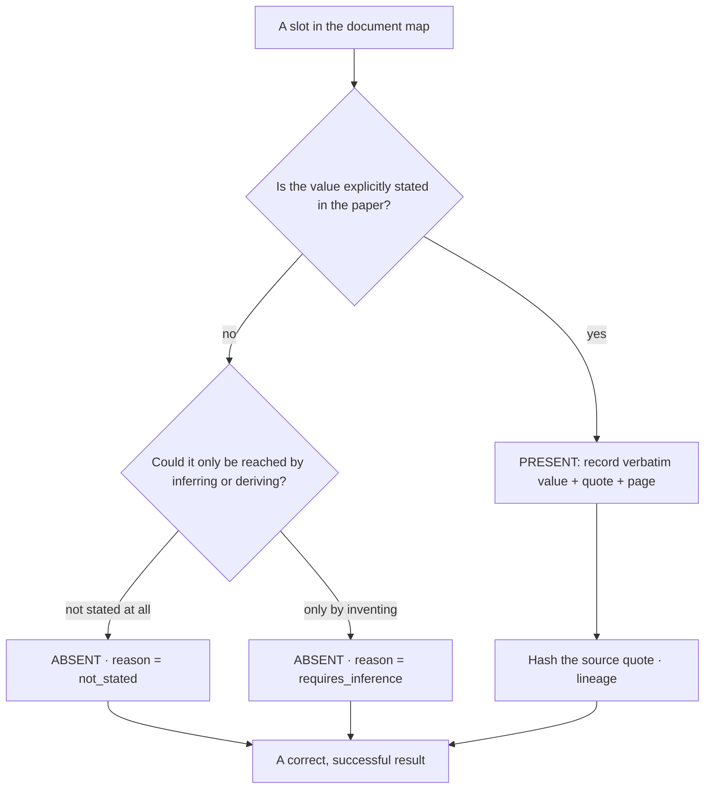

The canon is the single governing idea every other part of the system serves. It is the
answer to one question: **how do you extract a model from a paper without inventing anything
the paper does not actually say?**

## The principle

> Do not constrain the *space of valid models*. Constrain the *document*. Build a fixed map
> of the paper's structure, and at every slot force exactly one decision: **is this value
> stated in the document, or not?**

- **Present** — the value is stated. Record it verbatim, with the exact source quote and
  page. Never evaluate, simplify, or transform it.
- **Absent** — the value is not stated. Record an explicit *absent*, with a reason. Never a
  number, never a guess.

There is no third option. A slot is present or absent; it is never blank, and it is never
filled with something the document did not supply.

## Why an open question invents answers

A large language model hallucinates when asked an *open* question — "what is the diffusion
term?" — because the form of the question presumes an answer exists. The canon removes the
open question. Every slot is a *closed* present/absent decision against a fixed map, so the
model is never asked to produce a value, only to locate one or declare its absence.

## The load-bearing rule: the document presses, absence holds

Papers drive forward rhetorically — "thus we obtain", "substituting gives", "this yields" —
as though a value must exist because the argument needs one. The canon's central rule:

> That pressure does **not** create a value. If the paper never states it, the correct
> extraction is *absent* — deliberately, as a successful result, not a failure.

A correct extraction therefore returns *absent* for a pressed-for-but-unstated quantity, on
purpose. Returning *absent* is success.

## The decision, as a gate

The two absence reasons are deliberately the only two: a genuine gap in the document
(`not_stated`), or a value reachable only by inventing or deriving it (`requires_inference`)
— which the method refuses.

## Provenance for this page

- The canon as a governing document: `Agent Drafts/sde-extraction-approach/2026-06-05-document-architecture-canon.md`.
- The present/absent decision in code: `services/extraction/schema.py` (the `Slot` type).
- See also [Present / absent](/explanation/present-absent/) and
  [Provenance & lineage](/explanation/provenance/).

:::note[Open piece]
The canon also calls for representing the document's *transformation steps* (deterministic →
stochastic) as map nodes, with a present/absent decision at each step. That transformation-step
node is **not yet modeled** in the schema — it is the main open piece between the current
schema and the full canon. See [Reference → Extraction schema](/reference/schema/).
:::
