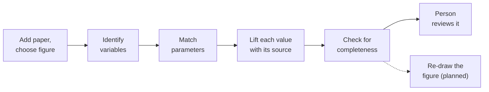

You do not have to take the result on trust. You can watch the work happen, step by step, and check it
yourself. This section explains what you are watching.

## The steps

1. You add a paper. The system finds its figures and you choose the one you want the model for.
2. It identifies the **variables** in that figure (the quantities that change over time).
3. It matches the **parameters** (the constants). See [Parameters](/explanation/parameters/).
4. It lifts each value off the page **with its source** (the quote, the page, a fingerprint).
5. It checks the model for **completeness** against the figure.
6. A **person reviews** the result before it is kept.
7. _Planned:_ re-draw the figure from the model to check it reproduces. The re-simulation tool is
   built and tested but not yet in the live run.

You can watch each step as it runs, and each step's result is recorded so you can come back to it.

## More in this section

- [How sure it is](/explanation/confidence/) — completeness is shown today, part by part; earned confidence is planned.
- [How it earns its confidence](/explanation/agent-health/) — how a person's review is intended to become trust over time (planned).
- [Where the data flows](/explanation/extraction-health/) — every place the data rests and moves.

To follow one paper through all of this, read [Follow a paper, step by step](/start/reproduce/).
