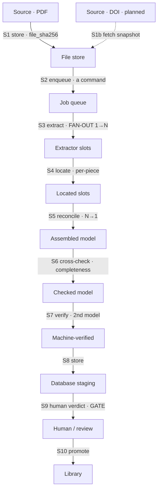

Observability here is not a dashboard of bar graphs. It is a **map of the system's data flow**:
where data rests, and every place it moves. The Extraction Health tab *is* that map. This page
explains the principle it's built on, so the picture and the words come from one source.

## Why a map, and not gauges

The pipeline is a **nearly-decomposable system** (Herbert Simon, *The Architecture of
Complexity*, 1962): a hierarchy of subsystems where interactions **within** a subsystem are
strong and frequent, and interactions **between** subsystems are weak — but never zero. Two
consequences we build on:

- **Short run**, each subsystem runs on its own dynamics — you can reason about the extractor
  without reasoning about the database.
- **Long run**, subsystems touch only through **aggregate/summary variables at their
  interfaces** — not internal detail.

So the places worth watching are the **interfaces** — the weak couplings where one subsystem
hands data to the next. Those are the only points where cross-system behavior is legible. We
call them **seams**, and the subsystems they connect **drawers** (data rests in a drawer, in a
form; it crosses a seam to land in the next drawer, often in a new form).

The full principle, the drawer/seam tables, and the design rules live in the architecture
record: [`docs/architecture/2026-06-13-nearly-decomposable-observability.md`](https://github.com/Lizo-RoadTown/SDE_Extraction).

## The drawers (where data rests)

| Drawer | the form data takes here |
|---|---|
| Source / file store | PDF bytes + a `papers` row |
| Job queue | a *command* (`extraction_jobs.target` = mode / figure_ref / lane) |
| Extractor (LLM) | the figure read into present/absent slots |
| Deterministic scripts | slots located, reconciled, cross-checked |
| Database (staging) | rows of the assembled model + lineage |
| Human / review | the V8 verdict |
| Library | verified models |

## The seams (every place data transfers, in order)

All intakes **converge at the job queue** (S2): a PDF upload today, a DOI fetch later, both
become the same command. From there the pipeline descends to the Library.

## Telemetry richness follows coupling

This is the load-bearing idea. **A seam's telemetry is as rich as its coupling is strong.**

- A **move** (1→1, form-preserving — S1, S2, S8, S10) needs almost nothing: *did it move, is it
  intact?* A thin pipe and an integrity dot.
- A **transform / fan-out** (1→many, a new form) needs the most. The richest seam is **S3,
  PDF → slots** — your *"one PDF becomes a thousand pieces in a new form."* It carries **type ·
  count · speed · integrity-per-piece**: how many variables and parameters came out, how long it
  took, whether each piece is schema-valid.

That asymmetry *is* near-decomposability made visible. In the tab, the move-seams draw as a
single line; S3 draws as one strand **bursting into many**. The telemetry is the shape, not a
number in a bar.

## Where the numbers come from

Every seam crossing writes one row to **`validation_events`** (migration `0005`): `point` (which
seam), `subject_kind` (`script` / `agent` / `human`), `outcome`, `latency_ms`, `lineage_ref`,
and `tags` (the type/count/tier detail). This is Simon's "interact only through aggregate
variables," recorded. The worker emits these today at **S3 (`extract`)**, **S4 (`locate`)**, and
**S8 (`store`)**; the dashboard aggregates them with `loadSeamTelemetry()`.

Each hook also stamps the **intake path** — `lane`, `mode`, and `source` (`upload` today, `doi`
once DOI fetch lands) — so a seam's telemetry **decomposes by where the data came in**. The
converging-intake header reads real per-origin counts from this, and `extract` records its
**latency** — the speed dimension that gives the fan-out its flow.

Seams that don't emit yet show **"no telemetry yet"** — honest, not hidden. As each pipeline
stage lands its hook, its seam goes live; the map never pretends to data it doesn't have.

## Governance lives at the seams

The validation gates **V1–V8** attach to exactly these couplings — the only places where
cross-system behavior is legible enough to govern. Watch a seam, learn its normal shape, then
write a rule on it (e.g. *S6 must show captured-vars == figure-panels before S8 stores*). That
is why this tab is where governance rules get authored: you can only govern what you can see,
and the seams are what you can see.

:::note[Design rule]
Every new capability is a module with a typed summary interface, and **every seam it introduces
emits a `validation_events` hook and gets added to the map**. If data crosses a boundary and
isn't observed, the seam map is incomplete — that's the bug.
:::
