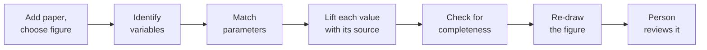

You do not have to take the result on trust. You can watch the process run and see what happens at
each step.

## The steps

1. The paper is added and a figure is chosen.
2. The variables are identified from the figure.
3. The parameters are matched to the figure.
4. Each value is lifted from the paper with its source.
5. The model is checked for completeness against the figure.
6. The figure is re-drawn from the model.
7. The result is reviewed by a person before it is kept.

## What you can see

- You can watch each step as it runs.
- Where the system is unsure, it shows its confidence.
- Each step publishes its statistics, for example how many values it found and how many it could
  confirm against the paper.
- Each step's result is recorded, so you can come back and check it later.
