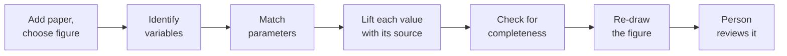

You do not have to take the result on trust. You can watch the process run and see what happens at
each step.

## The steps

1. The paper is added; the system finds its figures and you choose one.
2. The variables are identified from the figure.
3. The parameters are matched to the figure.
4. Each value is lifted from the paper with its source.
5. The model is checked for completeness against the figure.
6. The figure is re-drawn from the model.
7. The result is reviewed by a person before it is kept.

## What you can see

- You can watch each step as it runs.
- Each step's result is recorded, so you can come back and check it later.

## How sure it is, part by part

Confidence is not one number for the whole result. Each part of the process carries its own
confidence, so you can see exactly where the system is solid and where it is unsure.

| Part of the process | What its confidence tells you |
|---|---|
| Identify variables | how sure it is that it found the right variables for this figure |
| Match parameters | how sure it is that each constant belongs to this figure |
| Lift each value | how sure it is that a value was read correctly, word for word, from the paper |
| Check completeness | how sure it is that nothing the figure needs was missed |
| Re-draw the figure | how closely the figure it re-draws matches the one in the paper |

That confidence is earned, not assigned. Every time a person reviews an extraction, the outcome
raises or lowers the confidence for that kind of work, so the numbers reflect the system's real track
record on parts like this. Each part also publishes its statistics, for example how many values it
found and how many it could confirm against the paper, so you can read the confidence and the count
side by side.
