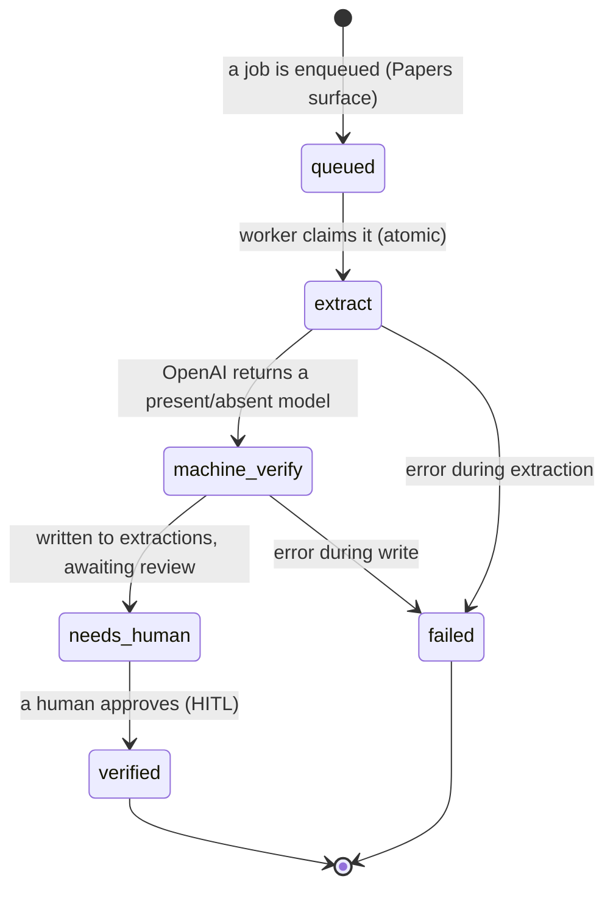

The extraction worker is a background process that polls a job queue, runs the extractor on
a paper, and writes a present/absent result for human review. It mirrors a proven
poll-worker pattern, with this project's own OpenAI + Pydantic extractor as the brain. It
lives in `services/extraction/` (`worker.py`, `processor.py`, `db.py`).

## The stages

## How a job is claimed

A job is claimed **atomically** so two workers never process the same one
(`UPDATE … FOR UPDATE SKIP LOCKED`). The worker then, for each job: marks it `extract`,
downloads the paper PDF, runs the extractor honoring the [targeting mode](/reference/targeting/),
locates each quote on the PDF, writes the present/absent result with its lineage hashes to
`extractions` (status `needs_human`, on the job's [`lane`](/reference/database/)), and marks
the job `stored`. An error marks the job `failed` with the message.

As it crosses each boundary it emits a **seam telemetry** row to `validation_events` — at
`extract` (the fan-out: PDF → many slots), `locate` (quotes pinned on the PDF), and `store`.
That is what the [Extraction Health seam map](/explanation/observability/) renders.

## Run modes

| Command | Behaviour |
|---|---|
| `python worker.py --daemon` | poll the queue forever (the container default) |
| `python worker.py --once` | drain queued jobs, then exit |
| `python worker.py --once --dry-run` | exercise the full loop with **no** OpenAI call (a stub result) |

The `--dry-run` path lets the entire pipeline — claim, write, status transitions — be tested
against a real database without spending model calls. With no database configured the worker
idles gracefully rather than failing.

## What runs today vs what's next

The worker loop, the atomic claim, the database writes, the Docker container, **and real
extractions against live papers** are running — results land in `extractions` for review, on
their lane, with seam telemetry emitted. The current brain is a single OpenAI structured-output
call (`processor.py` `run`) plus a deterministic locator pass.

The **next iteration** decomposes the extractor into a near-decomposable graph (one subagent
per figure-panel variable, a second-model verifier before storage, and a staging table), with a
LangGraph checkpointer for crash-resume — see
[`docs/proposals/2026-06-12-command-driven-hooked-pipeline.md`](https://github.com/Lizo-RoadTown/SDE_Extraction)
and the revisited [ADR 0001](/decisions/0001-openai-pydantic-over-langgraph/). It is not yet
deployed; the `extract` seam stays a single hop until it lands.

*Source: `services/extraction/worker.py`, `processor.py`, `db.py`, `locator.py`, `hooks.py`.*
