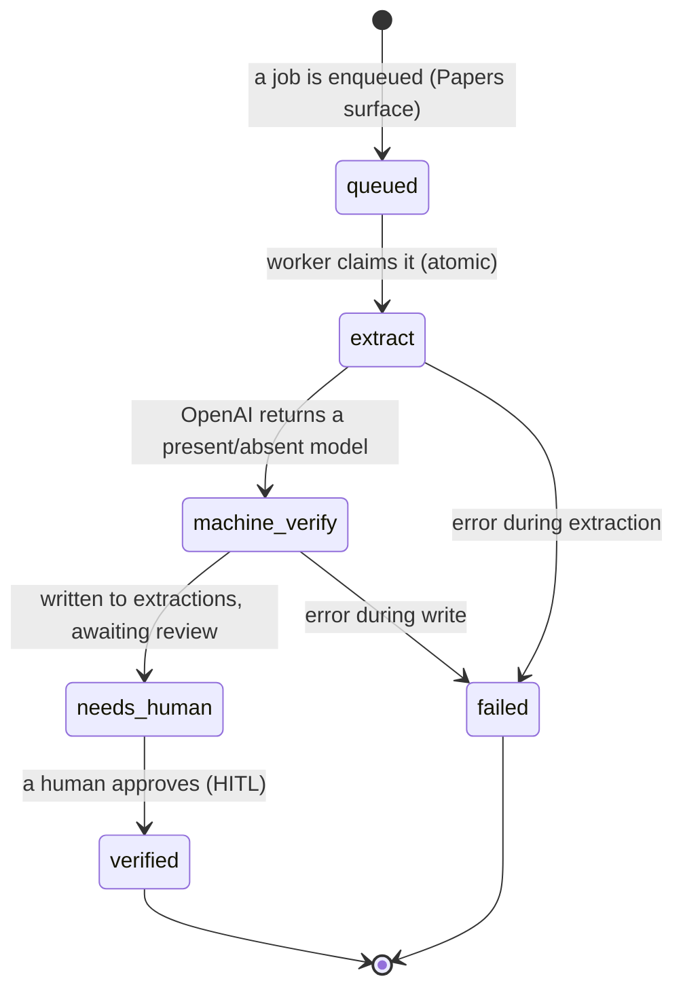

The extraction worker is a background process that polls a job queue, runs the extractor on
a paper, and writes a present/absent result for human review. It mirrors a proven
poll-worker pattern, with this project's own OpenAI + Pydantic extractor as the brain. It
lives in `services/extraction/` (`worker.py`, `processor.py`, `db.py`).

## The stages

## How a job is claimed

A job is claimed **atomically** so two workers never process the same one
(`UPDATE … FOR UPDATE SKIP LOCKED`). The worker then, for each job: marks it `extract`,
downloads the paper PDF, runs the extractor honoring the [targeting mode](/reference/targeting/),
writes the present/absent result with its lineage hashes to `extractions` (status
`needs_human`), and marks the job `stored`. An error marks the job `failed` with the message.

## Run modes

| Command | Behaviour |
|---|---|
| `python worker.py --daemon` | poll the queue forever (the container default) |
| `python worker.py --once` | drain queued jobs, then exit |
| `python worker.py --once --dry-run` | exercise the full loop with **no** OpenAI call (a stub result) |

The `--dry-run` path lets the entire pipeline — claim, write, status transitions — be tested
against a real database without spending model calls. With no database configured the worker
idles gracefully rather than failing.

## What is verified vs not

The worker loop, the atomic claim, the database writes, and the Docker container are
**verified** (the dry-run path has been run end-to-end against the live database). A **real
extraction against a live paper** has **not yet been run** — the schema is correct and the
call reaches OpenAI, but a billing quota currently blocks the model call. See
[How-to → Run the extraction worker](/how-to/run-worker/).

*Source: `services/extraction/worker.py`, `processor.py`, `db.py`.*
