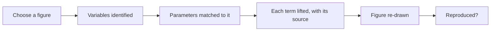

This shows how the model is read out of one paper, step by step. You can use it on your own model or
on another paper. At each step you can see what happened, watch it run, see the system's confidence,
and check that piece against the original paper. You do not need to run anything or know any software.

## 1. You choose one figure

You pick the single graph you care about. The system shows the model that figure came from: the
equations behind it.

## 2. The figure identifies the variables

Each curve or panel in the figure plots one variable, so the figure is the list of variables to
find. Each variable is labelled by its role (susceptible, infected, viral load, immune response), so
you can see what it represents.

## 3. Parameters are matched to that figure

For each variable, the system finds its equation in the paper. The constants in that equation are the
parameters for this figure's model. Each is labelled by role (transmission rate, recovery rate,
noise strength) and linked to the equation it came from.

## 4. Each term is lifted with its source

Every value is copied exactly as written, with the exact sentence, the page, and the highlighted
spot on the page. If the paper does not state a value, it is marked "not stated".

To check a piece: open that page, find the highlighted sentence, and confirm it matches.

## 5. A structured map checks that nothing is missed

A fixed map (the schema) lists every piece a model of this kind needs. Each slot is either filled
from the paper or shown as a gap, so no required piece is skipped without notice.

## 6. The figure is re-drawn from the model

The figure is re-drawn using only the extracted model, not the original image. If it matches the
paper's figure, the model produces the same result.

## What you can see

- You can watch the process run, step by step.
- Where the system is unsure, it shows its confidence.
- Each area publishes its statistics.

## Further reading

- FAIR principles: [go-fair.org/fair-principles](https://www.go-fair.org/fair-principles/)
- The Turing Way, a guide to reproducible research:
  [the-turing-way.org](https://the-turing-way.netlify.app/reproducible-research/reproducible-research)
- Allen (2017), an introduction to stochastic epidemic models:
  [doi.org/10.1016/j.idm.2017.03.001](https://doi.org/10.1016/j.idm.2017.03.001)
