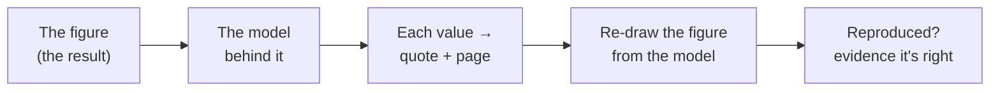

You are deciding whether a published stochastic epidemiological model holds up — and whether you
could reproduce its results. This page follows **one paper** through the system from start to finish.
At every step you see two things: **what the system did**, and **the evidence you can check yourself**
against the original paper. You don't need to run anything or know anything about software.

The whole idea: a result is only believable if you can trace it. So at each step the system shows
its work, and the proof is kept so you can return to it later.

## 1 · Start from the figure — the result itself

The thing you care about is a **figure** in the paper (for example, the simulated outbreak curves).
You choose that **one** figure. Everything else is worked out backward from it.

- **Why it matters:** a figure is a *produced outcome*. If the model behind it can be made to
  redraw that same figure, the model was captured correctly. The figure is the thing to reproduce.
- **What you see:** the actual figure, shown from the paper.

## 2 · Read the model behind the figure

The system reads the **equations** that produced that figure: the **variables** (what is being
tracked — e.g. susceptible, infected, recovered), the **parameters** (the constants — transmission
rate, recovery rate, noise strength), their **starting values**, and the two parts of a stochastic
model: the **drift** (the predictable part) and the **diffusion** (the random/noise part).

- **What you see:** the model laid out plainly — `change = (drift) + (noise)`.

## 3 · Every value traces to the paper — an exact quote and page

This is the heart of it. For **each** value, the system shows the **exact sentence and the page
number** it came from in the paper. You open the PDF to that page and confirm it with your own eyes.

:::note[This is what makes it verifiable]
Nothing is asserted that you cannot check against the original paper. A number on the screen is
never "trust us" — it is "here is the sentence, on this page; go look." That is the difference
between a claim and evidence.
:::

- **How you verify it yourself:** click the value, read the quoted sentence, open that page of the
  PDF, and check that it says what the system says it says.

## 4 · Missing values are reported, not invented

If the paper **never states** a value, the system says so — marked **"not stated"** — rather than
filling in a plausible-looking number. If a value could *only* be reached by guessing or deriving,
it is marked **"would require inference"** and left out.

- **Why it matters:** a fabricated value would quietly break reproduction — the figure might still
  "look right" for the wrong reasons. Reporting the gap honestly is what keeps the result
  trustworthy. (More on this in [What "not stated" means](/explanation/present-absent/).)

## 5 · Reproduce the figure from the model

The system then **re-draws the figure using only the extracted model** — nothing from the original
image, just the equations and values it captured. If the re-drawn figure matches the paper's, that
is the strongest possible evidence that the model is right.

- **Why it matters:** anyone can transcribe symbols; *regenerating the result* is reproduction.
  This is the test a skeptical reviewer actually wants.

## 6 · Watch it happen — and the proof is kept

Every step above is **observable as it runs**, and each step's result is **recorded permanently**.
You can come back later and walk the entire path again — the figure, the model, every value and its
source, the regeneration — without taking anyone's word for it.

- **Why it matters:** reproducibility is not a one-time screen; it's a durable record you (or the
  next reviewer) can re-check at any time. (See [Observability at each step](/explanation/observability/).)

## The point, in one line

You can check **every step** against the original paper: the model, where each value came from,
what was missing, and whether the result actually regenerates. That is reproducibility you can see,
not a promise.

## Further reading

- The case for traceable, reusable research data — the **FAIR principles**:
  [go-fair.org/fair-principles](https://www.go-fair.org/fair-principles/)
- A practical guide to reproducible research — **The Turing Way**:
  [the-turing-way.org](https://the-turing-way.netlify.app/reproducible-research/reproducible-research)
- A readable introduction to the kinds of stochastic epidemic models this handles — **Allen (2017),
  *A primer on stochastic epidemic models***:
  [doi.org/10.1016/j.idm.2017.03.001](https://doi.org/10.1016/j.idm.2017.03.001)
