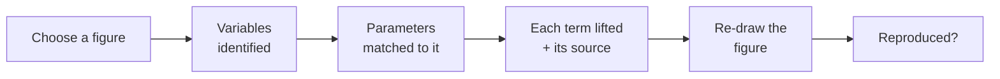

No black box. Whether you're confirming your **own** model before you publish, or following a
colleague's work, this shows exactly **how** the model is lifted out of one paper. At every step you
can see what happened, **watch it work**, see **how confident** the system is, and **check that
piece yourself** against the original paper.

## 1 · You choose one figure — and see the model it points to

You pick the single graph you care about. The system shows you the **model that figure came from** —
the equations behind it — so it's clear from the start which model is being checked.

## 2 · The figure identifies the variables

Each curve or panel in the figure plots **one variable**, so the figure itself is the checklist of
variables to find. Each variable is also labelled by its **role** — susceptible, infected, viral
load, immune response — so you can see *what it represents*, not just its symbol.

## 3 · Parameters are matched to that figure

For each variable, the system finds its equation in the paper; the constants in that equation are the
**parameters that belong to this figure's model**. Each is labelled by role too — transmission rate,
recovery rate, noise strength — and tied back to the equation it came from.

## 4 · Each term is lifted from the paper — with its source

This is the open box. Every value is copied **exactly as written** and shown with the **exact
sentence, the page, and the highlighted spot on the page**. Nothing is summarised or guessed.

- **Reproduce this piece:** open that page, find the highlighted sentence, and confirm it says what
  the system says it says.
- If the paper never states a value, it's marked **"not stated"** — never filled in.

## 5 · A structured map makes sure nothing is missed

Behind all of this is a fixed map (the **schema**) of every piece a model of this kind needs. Each
slot in the map is either filled from the paper or shown as a gap — so no required piece is silently
skipped. That map is why the result is *complete*, not just *plausible*.

## 6 · Re-draw the figure from the model

Using **only** the lifted model — nothing from the original image — the figure is re-drawn. If it
matches the paper's, that's direct, shared evidence the model was captured faithfully.

## You can watch it, and see how sure it is

- **Watch the whole process work**, step by step, as it runs.
- Where the system is **unsure, its confidence is shown openly** — uncertainty is surfaced, not hidden.
- **Every area publishes its stats**, so you can see how it performs across the board — the same
  measures for every paper.

## Further reading

- Making research findable and reusable — the **FAIR principles**:
  [go-fair.org/fair-principles](https://www.go-fair.org/fair-principles/)
- A practical guide to reproducible research — **The Turing Way**:
  [the-turing-way.org](https://the-turing-way.netlify.app/reproducible-research/reproducible-research)
- An introduction to the kinds of stochastic epidemic models this handles — **Allen (2017)**:
  [doi.org/10.1016/j.idm.2017.03.001](https://doi.org/10.1016/j.idm.2017.03.001)
