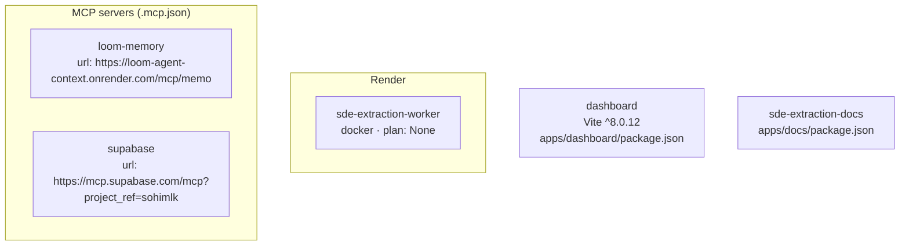

# Architecture snapshot — 2026-06-18T06:55:21.460563+00:00

**Git SHA:** `6b6bbd4b46f450e370299ef245f5829bbfaa7049`
**Repo shape (auto-detected):** `mixed`
**Generated by:** canonical `architecture_snapshot.py` in `liz-patterns` plugin

Deterministic + shape-agnostic. For prose narrative and diagnosis, see the
matching `-narrative.md` (produced by the architecture-analyst agent).

## Diagram

## Render (backend hosting)

### Service: `sde-extraction-worker`
- Runtime: docker, plan: None, region: None
- Auto-deploy: True, previews: None
- Env var keys (7): `DATABASE_URL`, `OPENAI_API_KEY`, `OPENAI_MODEL`, `POLL_INTERVAL`, `PYTHONUNBUFFERED`, `SUPABASE_SERVICE_ROLE_KEY`, `SUPABASE_URL`

## Node packages (2 package.json)

### `apps/dashboard/package.json` — dashboard v0.0.0
- Scripts: `dev`, `build`, `lint`, `preview`
- Total deps: 9, devDeps: 13
- Key pinned versions:
  - `@supabase/supabase-js`: `^2.107.0`
  - `react`: `^19.2.6`
  - `react-dom`: `^19.2.6`
  - `tailwindcss`: `^4.3.0`
  - `typescript`: `~6.0.2`
  - `vite`: `^8.0.12`

### `apps/docs/package.json` — sde-extraction-docs v0.0.1
- Scripts: `dev`, `build`, `preview`
- Total deps: 5, devDeps: 0

## Python dependencies (2 manifests, 10 packages)

### `scripts/requirements-spike.txt` (requirements.txt, 3 packages)
- `pillow`
- `pymupdf`
- `requests`

### `services/extraction/requirements.txt` (requirements.txt, 7 packages)
- `openai >=1.40.0`
- `pdfplumber >=0.11.0`
- `psycopg[binary] >=3.1.0`
- `pydantic >=2.0.0`
- `pymupdf >=1.24.0`
- `python-dotenv >=1.0.0`
- `supabase >=2.0.0`

## MCP servers (`.mcp.json`)

- `loom-memory` — url: `https://loom-agent-context.onrender.com/mcp/memory/`
- `supabase` — url: `https://mcp.supabase.com/mcp?project_ref=sohimlkvueagelulsrgi&features=docs%2Caccount%2Cdatabase%2Cdebugging%2Cdevelopment%2Cfunctions%2Cbranching%2Cstorage`

## Top-level inventory

### Directories (depth-1)

| Directory | Files (depth 1) | Subdirs |
|---|---:|---:|
| `Agent Drafts/` | 1 | 2 |
| `apps/` | 1 | 2 |
| `AT3_review/` | 4 | 9 |
| `docs/` | 1 | 7 |
| `Human validated/` | 1 | 0 |
| `research/` | 1 | 4 |
| `scripts/` | 7 | 1 |
| `services/` | 1 | 1 |
| `skills/` | 0 | 0 |
| `skills_private/` | 0 | 0 |
| `supabase/` | 0 | 1 |

### Notable root files

- `.env.template` (file)
- `.mcp.json` (file)
- `.project-intelligence` (dir)
- `CLAUDE.md` (file)
- `README.md` (file)
- `render.yaml` (file)
