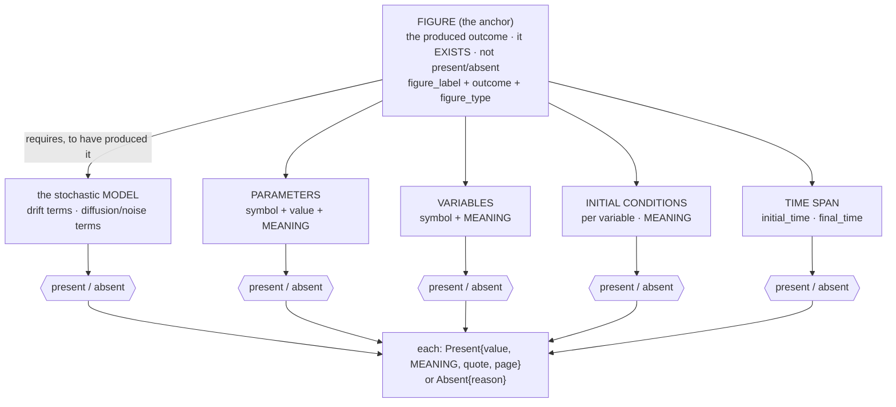
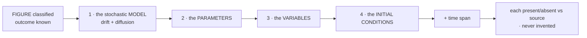
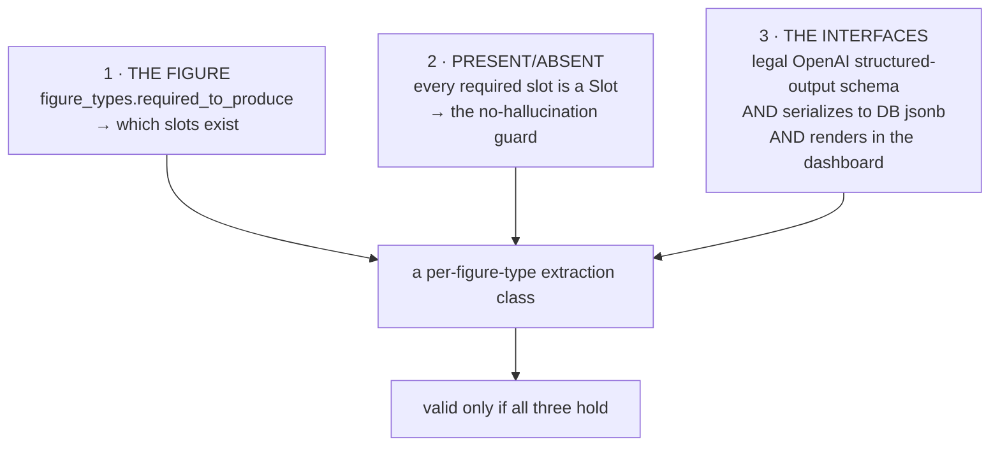

# Figure-anchored extraction schema — design

*Design, Liz 2026-06-12. The figure is the ANCHOR (the produced outcome — it exists, it is
not present/absent). Everything the figure *requires to be produced* — the model, parameters,
variables, initial conditions, drift, diffusion, time span — is each **present or absent**
against the source, carrying **rich meaning metadata**. Built as OpenAI + Pydantic classes
under a triple constraint. Grounded in the real Dengue OU completed review and
`AT3_review/curation-dev/template/curation-template.ipynb`.*

## The shape: figure anchors, the machinery is present/absent



The figure is on top, fixed. Below it, every required piece resolves to a `Slot` — present
(with its verbatim value, **meaning**, source quote, page) or absent (with a reason). The
figure is never a `Slot`; the things it demands always are.

## The backward search this drives



Finite and directed because the figure bounds it: the outcome could only have come from a
model with these parts, so these are exactly what to look for. (Order per Liz: model →
parameters → variables → initial conditions.)

## The triple constraint on every class

Each extraction class must satisfy all three at once — a class violating any is invalid:



**Why Pydantic, not straight Python:** one Pydantic class is the single contract that OpenAI,
the database, and the dashboard all honor — it *constrains* the model's output (structured
outputs), *validates* present/absent, and *serializes* clean to `jsonb` and to typed UI
objects. Straight Python gives none of these guarantees.

## Rich meaning metadata (Liz: "as much metadata of their meaning as possible")

The curation template is thin — names + values only. We capture, per present slot, what it
**represents**, not just its symbol/value. Grounded in the Dengue OU review where `S,I,V,Z,x`
and `mu,alpha,…,sigma` each mean something specific (susceptible cells, infection rate, the
OU log-process, noise intensity…). The `Present` slot already has a `meaning` field; we
enrich the per-piece models (variable/parameter) with role + units + symbol so meaning is
first-class.

## The present/absent gate is REAL in the curation template

This isn't theoretical. The template (`curation-template.ipynb` cell 5) literally computes:

```python
missing_ics    = [n for n in variable_names if n not in initial_values]
missing_params = [n for n in parameter_names if n not in parameter_values]
```

— a by-hand present/absent check on initial conditions and parameters. And the Dengue OU
review's `x_bar` is a textbook **absent**: its Notes say *"x_bar value not explicitly
defined… the relationship is never stated explicitly"* → `Absent(reason=requires_inference)`.
Our schema makes this check structural instead of manual.

## The classes (what changes in schema.py)

- **`Present`** gains nothing required (already has `value, meaning, quote, page`) — but we
  treat `meaning` as mandatory-rich.
- **`Variable`** = `symbol` (anchor) + `meaning_slot: Slot` (what it represents, present/absent)
  + `initial_value: Slot`. *(symbol is known from the figure's needs; meaning + IC are searched.)*
- **`Parameter`** = `symbol` + `value: Slot` + `meaning_slot: Slot` (+ optional units).
- **`Term`** (drift/diffusion) = `variable` + `expression: Slot`.
- **`TimeSpan`** = `initial_time: Slot` + `final_time: Slot`.
- **`FigureExtraction`** = the figure ANCHOR (`figure_label`, `outcome`, `figure_type`,
  `pathogen` as context) + the required machinery as present/absent lists. The figure fields
  are **not** Slots.

Per-figure-type specialization: `required_to_produce` selects *which* of these lists are
mandatory for a given figure type (seeded from completed reviews). v1 can use one
`FigureExtraction` shape with the profile guiding the prompt; per-type generated classes are
the next step.

## Seeding from completed reviews

The first figure-type profiles + their required slots come from a few **already-completed**
AT3 reviews (Dengue OU, etc.) — known-good paper→model extractions. Real, validated data, not
invented. Each seed gives: the figure, its type, and the exact variables/params/ICs/drift/
diffusion that had to be present.

## Honest status

- Extends the existing `schema.py` (the present/absent `Slot` + the anyOf-not-oneOf interface
  fix are already in).
- v1 = one figure-anchored class with rich-meaning slots + time span; per-figure-type
  generated classes follow.
- The interface (dashboard) slots come after the schema, rendering: the figure anchor on top,
  then each required piece as a present/absent slot with its meaning.

## Open items

1. Per-figure-type class generation: runtime `create_model` from the profile vs. a stored
   class per type. (Seed from completed reviews first; decide generation after.)
2. Exact meaning fields (role, units, symbol-vs-name) — refine against more completed reviews.
3. Multi-label figures (a panel that is two types) — single type per figure in v1.
