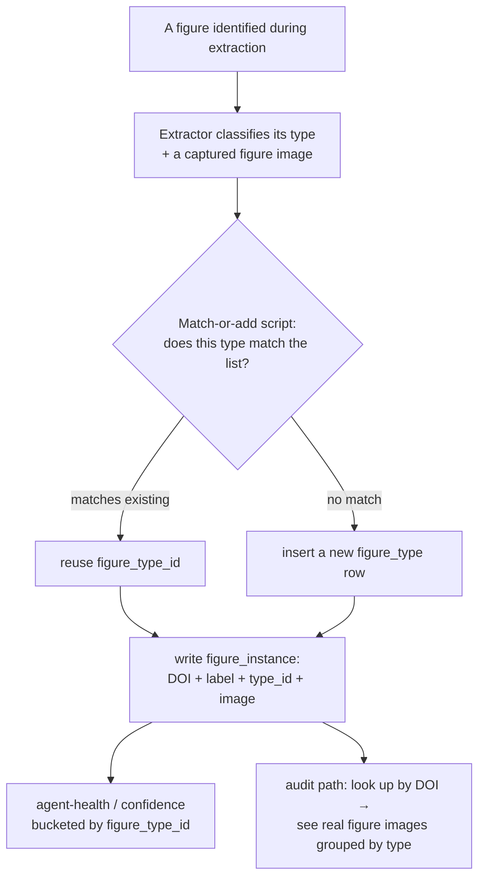

# Figure types — self-growing reference list, schema + match-or-add

*Design, Liz 2026-06-12. Figure types are not a hand-curated taxonomy — they are a
**self-growing reference list in Supabase**, whose purpose is to be a stable **join key
for agent-health and confidence metrics**. The list bootstraps from the data: the extractor
classifies a figure, a script matches it to the list or adds a new type. Each figure is tied
to its DOI and a captured figure image so groupings are auditable by looking at the real
figures.*

## Why this exists (not taxonomy — telemetry keys)

Agent health (and therefore [confidence](2026-06-11-confidence-and-tagging is the pillar))
is tracked **per figure type**: "the extractor is healthy on stationary-distribution figures
but degrading on sensitivity sweeps." That sentence is only possible if figure types are
**identified, stable, tied keys**. The list is the *dimension* the
[validation-points telemetry](2026-06-12-validation-points-map.md) buckets agent health by.
So the list must be defined, stable-id'd, and maintained — it is a join key, not a
description. (Figure type is already named as a confidence dimension in
`apps/dashboard/src/surfaces/ExtractionHealth.tsx`.)

## The model (like a search index that grows itself)

No one enumerates every type up front. The corpus reveals them:



## Schema (Supabase, alongside the other metadata)

```sql
-- the growing list — each type a row with a STABLE id (the telemetry join key)
create table figure_types (
  id            uuid primary key default gen_random_uuid(),
  name          text not null unique,        -- normalized type name (the match key v1)
  description   text,                         -- what this type shows
  recognized_by text,                         -- visual/caption cues (notes for auditing)
  status        text not null default 'active', -- active | merged | deprecated
  merged_into   uuid references figure_types(id), -- if this type was later merged
  created_at    timestamptz not null default now(),
  -- provenance of the type's creation
  first_seen_doi  text,                       -- the DOI whose figure first introduced it
  created_by      text                        -- 'match-or-add-script' | 'human'
);

-- each identified figure instance — tied to its DOI + a captured image, for audit
create table figure_instances (
  id              uuid primary key default gen_random_uuid(),
  doi             text not null,              -- the paper (links to doi_queue / snapshots)
  snapshot_id     uuid references snapshots(id), -- the source snapshot it came from
  figure_label    text not null,              -- 'Figure 2', etc.
  figure_type_id  uuid references figure_types(id), -- the assigned type (nullable until classified)
  -- the captured figure image — so groupings are auditable by looking
  image_storage_key text,                     -- the figure image (crop/snapshot) in object storage
  image_sha256      char(64),                 -- fixity of the figure image
  -- the classification record
  classified_by   text,                       -- the extractor agent + version that classified it
  classifier_caption text,                    -- caption text the classifier used (often decisive)
  proposed_type_name text,                    -- what the extractor called it (before match-or-add)
  match_outcome   text,                        -- 'matched' | 'added_new'
  classified_at   timestamptz not null default now(),
  unique (doi, figure_label)
);
create index on figure_instances (figure_type_id);
create index on figure_instances (doi);
```

## The match-or-add script (extractor proposes, the list decides)

1. The extractor, during extraction, **classifies** each figure: a `proposed_type_name`,
   the caption it read, and a captured figure image.
2. The script checks the proposed name against `figure_types`:
   - **match** → reuse that `figure_type_id`, `match_outcome = 'matched'`.
   - **no match** → insert a new `figure_types` row (`created_by = 'match-or-add-script'`,
     `first_seen_doi`), use its id, `match_outcome = 'added_new'`.
3. Write the `figure_instance` with DOI + label + type_id + image + the classification record.

**Match strategy — start simple, refine later (Liz):**
- **v1:** normalized exact-name match (lowercase, trim, basic synonym map). Ships the
  self-growing list immediately.
- **later:** fuzzy / semantic (embedding) match above a threshold, when real data shows the
  name-only match is over-splitting. The schema doesn't change — only the match function.

## The audit path (catch wrong groupings by looking)

Because every instance carries `doi + figure_label + figure_type_id + image`, you can:
- Look up a DOI → see its figures and assigned types.
- Pull **all instances of one figure_type_id** → view the real figure images grouped together
  → spot mis-groupings (a sensitivity sweep filed as a sample-path).
- **Re-sort:** correct an instance's `figure_type_id`, or merge two over-split types
  (`status='merged', merged_into=…`). Agent-health metrics re-bucket automatically because
  they key on `figure_type_id`.

## Findings from the 3-source research that shape the classifier (input, not the list)

The reasoned/empirical/literature comparison (workflow `wwiehssea`) was *seed input*. Three
findings affect the **classifier**, not the list shape:
- **Caption-dependence:** single-path vs ensemble-mean vs multi-path are visually
  near-identical — separable only by caption text. So the classifier should get the
  **caption** (`classifier_caption`), not just the image.
- **Co-occurrence / multi-label:** one panel can be two types at once (a sweep that is also a
  det-vs-stochastic overlay). *Open:* allow an instance to carry more than one type, or
  classify per-panel? (v1: one type per figure; revisit.)
- **Exclusion classes:** schematics/flow-diagrams and ML-training plots are *non-results* —
  the list should hold them (as types with an `exclude`-style status or a flag) so the
  bulk auto-picker never targets them.

## Honest status

- **Designed, not built.** Extends the validated DOI-snapshot intake; the tables reference
  `snapshots`/`doi_queue` from that model.
- The captured **figure image** depends on extracting a figure crop from the source snapshot
  — feasible from JATS XML (figure assets) or a rendered page; settle the mechanism at build.
- The list **starts empty** and grows from real extractions — it does not get pre-seeded with
  the research's types (those are a sanity-check for what match-or-add will encounter).

## Open items

1. Match function v1 normalization + synonym map (what counts as the same name).
2. Multi-label per figure/panel: yes or no.
3. Exclusion-class representation (status flag vs separate concept).
4. Figure-image capture mechanism (XML asset vs page crop).
